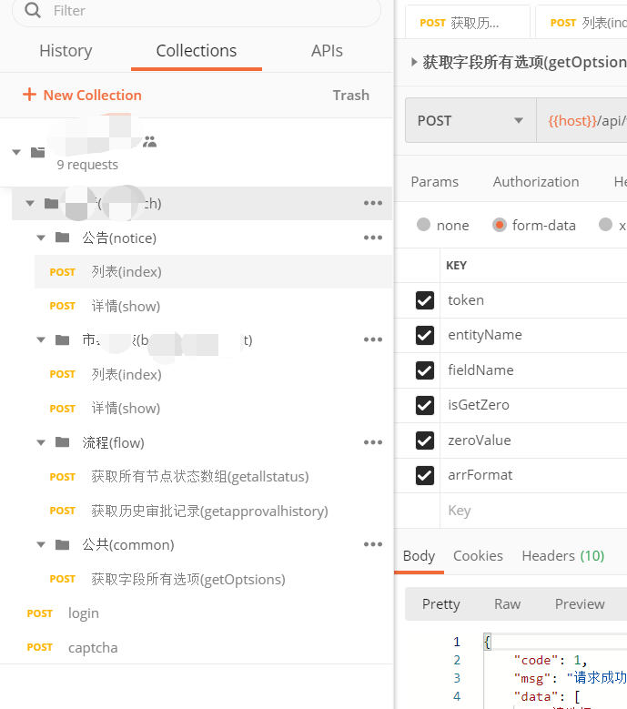
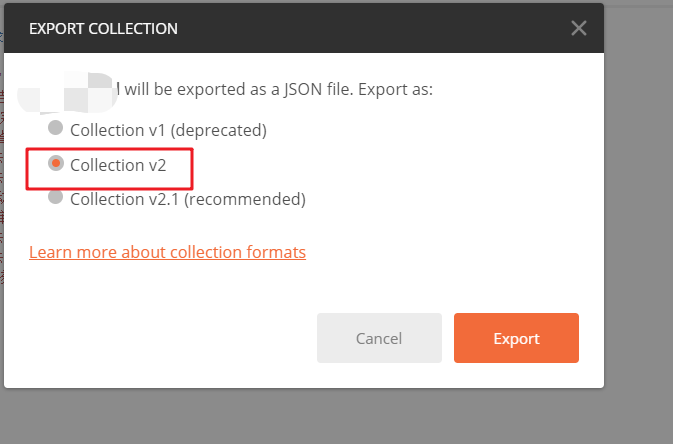

# postman 转 markdown api

## 要求

目录结构如下



导出json选择v2版本



## 使用

修改脚本路径, 通过请求或者命令行即可在{$generateRootDir}中生成文件夹及对应文件
```php
<?php

// postman 导出 json文件位置
$file = 'C:\Users\Administrator\Desktop\party_shool.postman_collection.json'; 
// 生成到的目录
$generateRootDir = __DIR__.'/postmanjson2md_generate_files';

...
```

## 结果

根据命令调用(如上图会生成下面内容)
```
    postmanjson2md_generate_files
     └── xxx
         ├── xxx.md
         ├── common.md
         ├── flow.md
         └── notice.md
```

文件内部结构为
```
## 公告(notice)

- 列表(index)
    - 请求方式: POST
    - 请求地址：`{{host}}/api/v1/research/notice/index`
    - 参数：
        - token      用户token `S25WcWp4Z3pQLyszdExHVXh0RXBBalNrcWZ1T0p4cUNnTkdwRmJTWkpWND0=`
        - page        `1`
        - title      搜索项(标题) `a`
        - type       搜索项(类型) `1`
        - flowPlaceEnName 搜索项(流程) `draft`

    - 返回值
        - code != 1,提示msg信息
        - code == 1

                    {
					    "code": 1,
					    "msg": "请求成功",

    ...
```